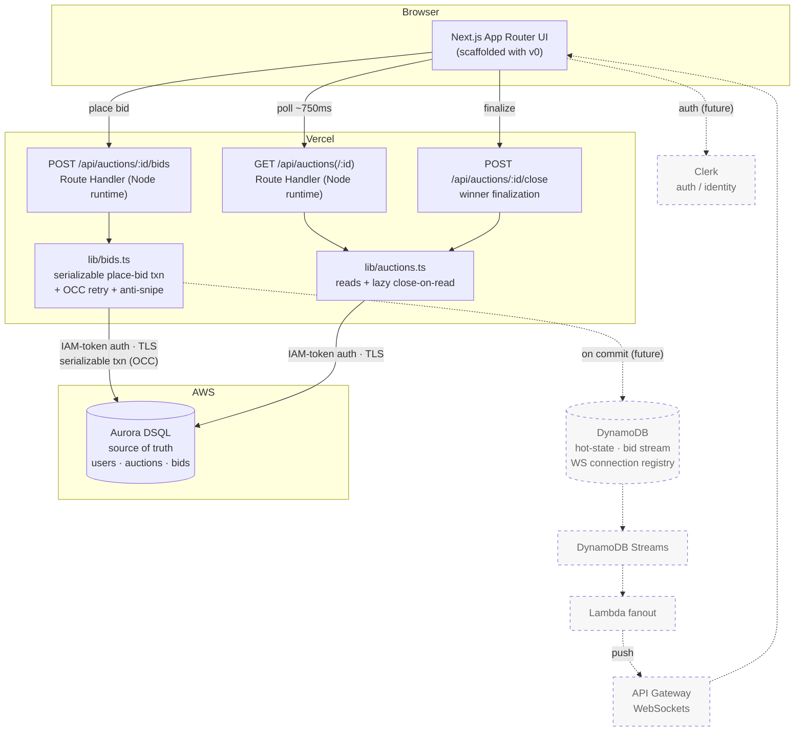
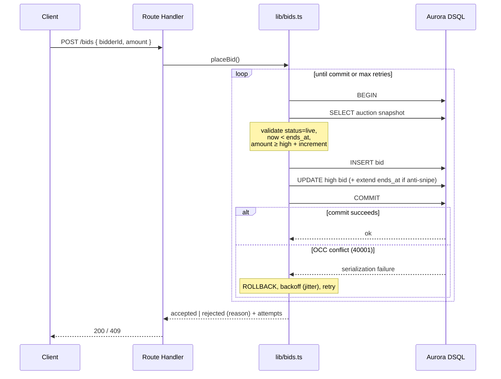

# GavelLive — Architecture

Real-time global auction house. **Aurora DSQL is the hero**: the strong-consistency
source of truth that guarantees correctness under heavy bid concurrency.

> Diagrams are [Mermaid](https://mermaid.js.org) — they render natively on GitHub
> and most Markdown viewers. Solid = built & proven; dashed = planned/future work.

---

## System diagram

---

## Place-bid transaction (the correctness core)

Aurora DSQL uses **optimistic concurrency control** — no row locks. Concurrent
bids read the same snapshot; at COMMIT, DSQL aborts whichever transaction would
break serializability (SQLSTATE `40001`). The handler catches that, re-reads the
now-higher price, and retries with backoff.

---

## Proven correctness (load test on real DSQL)

`scripts/load-test.mjs` fires N concurrent bids at the live endpoint, then
verifies invariants directly against DSQL:

| Invariant | Result (300 concurrent bids) |
|---|---|
| No lost / duplicate writes (bid rows == accepted responses) | ✅ |
| Final price == highest accepted bid == `MAX(bids.amount)` | ✅ |
| Exactly one `current_high_bidder`, and it is the top bidder | ✅ |
| OCC retries observed (contention was real) | 414 extra attempts, max 4 on one bid |

---

## Components

| Component | Status | Notes |
|---|---|---|
| Next.js (App Router) on Vercel | ✅ Built | UI scaffolded with v0 (pending credits) |
| Aurora DSQL | ✅ Live | Single-region us-east-1; IAM-token auth from serverless |
| Place-bid OCC transaction + anti-snipe | ✅ Built & proven | `lib/bids.ts` |
| Winner finalization (lazy close-on-read + force-close) | ✅ Built | `lib/auctions.ts` |
| Concurrency load-test harness | ✅ Built | `scripts/load-test.mjs` |
| Clerk auth | ⏳ Planned | Installed; not yet wired |
| DynamoDB hot-state + Streams fanout | ⏳ Future | Phase 4 push scale-out |
| API Gateway WebSockets push | ⏳ Future | Replaces ~750ms polling |

---

## Data model (Aurora DSQL — PostgreSQL subset)

`users(id, clerk_id, email, display_name, created_at)`
`auctions(id, seller_id, title, …, starting_price, bid_increment, reserve_price,
current_high_bid, current_high_bidder_id, status, anti_snipe_window_secs,
anti_snipe_extend_secs, starts_at, ends_at, created_at)`
`bids(id, auction_id, bidder_id, amount, created_at)` — append-only

DSQL has no FOREIGN KEY constraints, so referential integrity is enforced in the
application layer; UUID primary keys via `gen_random_uuid()`.
