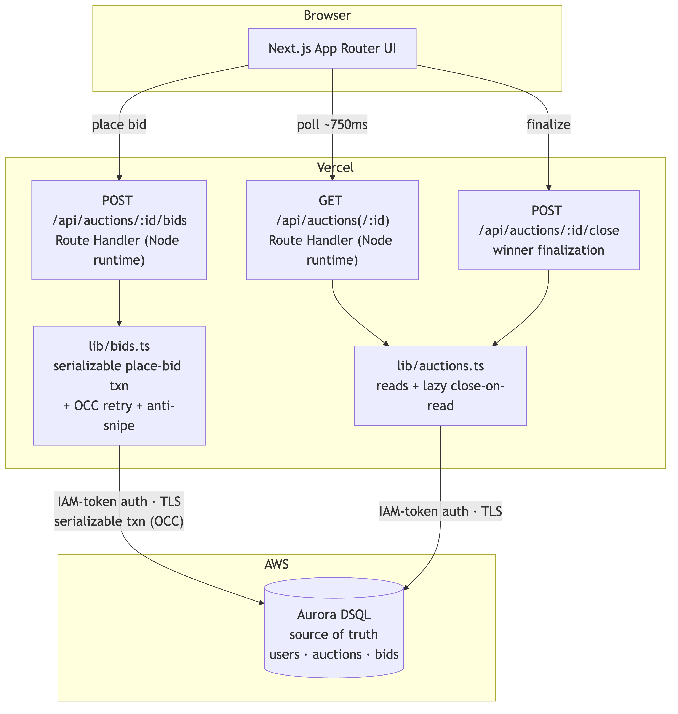

# GavelLive

**A real-time live-commerce auction platform built to scale to millions.**
Collectors compete in live, time-boxed bidding events for high-demand goods —
watches, cars, jewelry, rare books — the same live-drops format that powers
modern entertainment commerce. Thousands of people can bid on the same lot at the
same instant, and GavelLive proves, on screen, that every sale stays correct under
that load: zero lost writes, a price that only moves up, and exactly one winner.
That guarantee comes from **Amazon Aurora DSQL**.

> Built for the **H0 Hackathon** (Hack the Zero Stack with Vercel v0 + AWS Databases).

<p align="center">
  <a href="https://www.youtube.com/watch?v=IcCN94iFmVs">
    
  </a>
  <br>
  <em>▶ Watch the demo</em>
</p>

🔗 **Live app:** https://gavellive.vercel.app
&nbsp;·&nbsp; 🎬 **Demo video:** https://www.youtube.com/watch?v=IcCN94iFmVs
&nbsp;·&nbsp; **Health check:** [`/api/health/db`](https://gavellive.vercel.app/api/health/db)
&nbsp;·&nbsp; **Auctions API:** [`/api/auctions`](https://gavellive.vercel.app/api/auctions)

---

## Why it's interesting

Live commerce — Whatnot, TikTok live drops, real-time bidding events — is one of
entertainment's fastest-growing formats, and it's a brutal distributed-systems
problem the moment it goes global: many writers worldwide, one shared piece of
state, money on the line, and **no room for error**. Two bids must never both win.
The price must only go up. The last bid before the clock hits zero must count. Do
this for one lot, then design it to hold for millions of bidders at once.

Most demos hand-wave this. GavelLive makes correctness its core feature, builds an
architecture designed to scale that drama globally, and ships a load test that
**demonstrates** the guarantee instead of asserting it.

## The correctness core

Every bid runs as a single **serializable transaction** on Aurora DSQL
([`gavellive/src/lib/bids.ts`](gavellive/src/lib/bids.ts)):

```
BEGIN
  read auction snapshot
  validate  (live · not ended · amount ≥ high + increment)
  insert bid
  update high bid + bidder
  extend ends_at if inside the anti-snipe window
COMMIT
```

Aurora DSQL uses **optimistic concurrency control** — no row locks. When two bids
race, DSQL aborts whichever commit would break serializability (SQLSTATE `40001`);
the handler catches it, re-reads the now-higher price, and retries with jittered
backoff. Business rejections (bid too low, auction ended) return immediately.

## Proven, not claimed

300 concurrent bids fired at the **live** endpoint, with invariants verified
directly against DSQL ([`gavellive/scripts/load-test.mjs`](gavellive/scripts/load-test.mjs)):

| Invariant | Result |
|---|---|
| No lost / duplicate writes (bid rows == accepted responses) | ✅ |
| Final price == highest accepted bid | ✅ |
| Exactly one winner, and it's the top bidder | ✅ |
| OCC contention actually occurred | 414 retry attempts, max 4 on one bid |

The same proof runs in-app: open the Patek lot and hit the **Concurrency proof**
panel to watch real DSQL transactions race and every invariant turn green.

## Architecture

Browser → Next.js route handlers on Vercel → Aurora DSQL (single source of truth),
over IAM-token auth and TLS.

<p align="center">
  
</p>

Full diagram, place-bid sequence, and data model in
[`ARCHITECTURE.md`](ARCHITECTURE.md); diagram sources in [`diagrams/`](diagrams/).

## Tech stack

Next.js (App Router) · Vercel · **Amazon Aurora DSQL** · TypeScript ·
node-postgres · AWS SDK · Tailwind CSS

## Run locally

The app lives in [`gavellive/`](gavellive/). See
[`gavellive/README.md`](gavellive/README.md) for full setup.

```bash
cd gavellive
cp .env.example .env.local   # fill in DSQL endpoint + AWS creds
npm install
npm run db:push              # apply schema to the cluster
npm run seed                 # seed users + the demo auction floor
npm run dev                  # http://localhost:3000
npm run loadtest             # fire the concurrency proof from the CLI
```

## Repo layout

| Path | What's there |
|---|---|
| [`gavellive/`](gavellive/) | The Next.js application (app, API routes, lib, scripts) |
| [`ARCHITECTURE.md`](ARCHITECTURE.md) | System diagram, place-bid sequence, data model |
| [`diagrams/`](diagrams/) | Rendered architecture diagrams (Mermaid source + PNG) |
| [`prompts/`](prompts/) | Build notes, planning docs, demo script, and submission prep |

---

> **Disclaimer:** Product images are royalty-free demo assets from Unsplash.
> Listings are sample data for demonstration purposes only.

*This project was created for the H0 Hackathon. #H0Hackathon*
